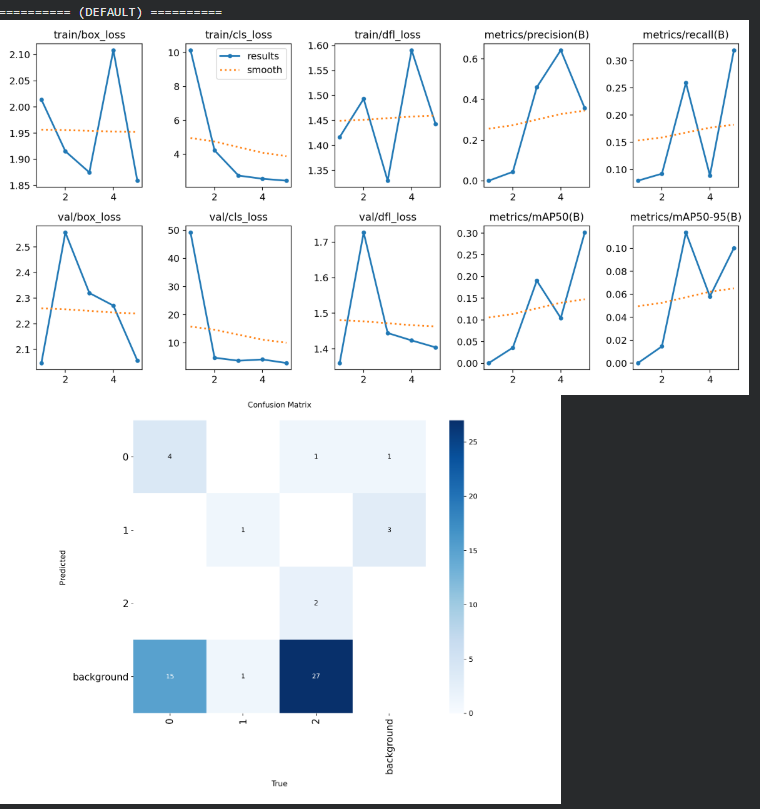
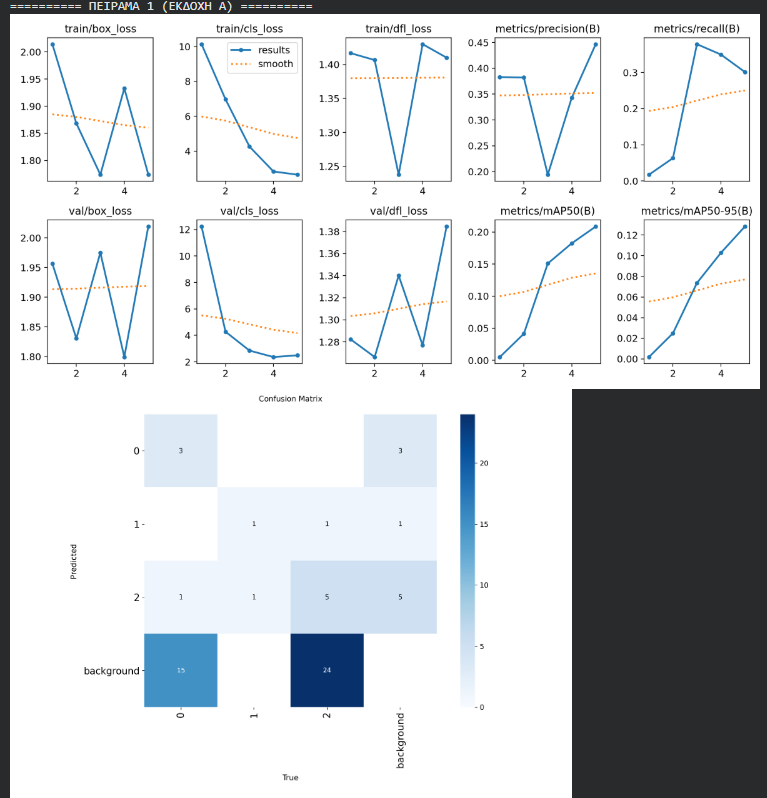
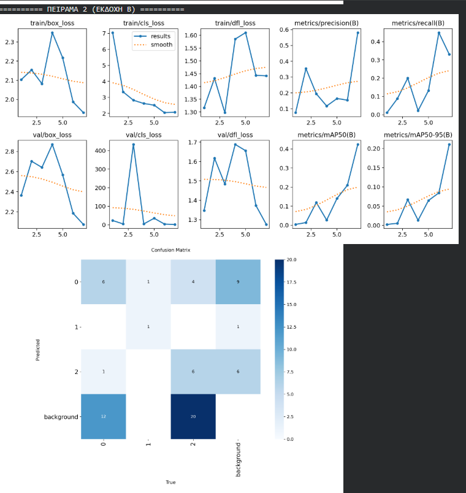
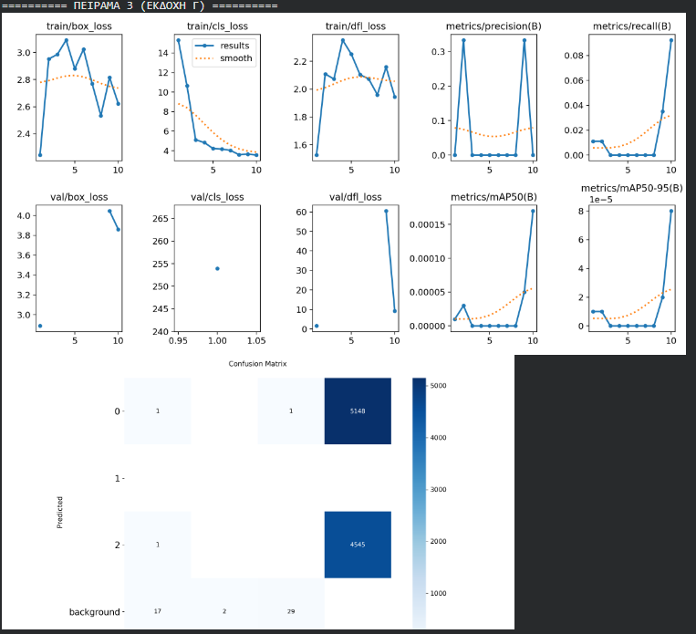

# YOLOv8-UAV-Detection

This repository contains the training and evaluation process of a YOLOv8 object detection model, specifically optimized for detecting drones (UAVs) in real-world scenarios.

## 📋 Project Description
The goal of this project is to compare various training parameters to optimize detection accuracy (mAP). Several experiments were conducted by adjusting optimizers, learning rates, and input image sizes.

## 📁 Contents
- `yolov8_uav_training.ipynb`: The Google Colab Notebook containing the full implementation and training pipeline.
- `exp_default.png`, `exp_a.png`, `exp_b.png`, `exp_c.png`: Performance charts and confusion matrices for each experimental run.

## 🚀 Experiments & Results

### 1. Default Configuration (Baseline)
Initial training using default Ultralytics hyperparameters.

### 2. Experiment A (SGD Optimizer)
Switched the optimizer to SGD with a Learning Rate of 0.01 to monitor convergence.

### 3. Experiment B (Image Resizing)
Reduced input image size (imgsz=500) to evaluate performance vs. speed.

### 4. Experiment C (Increased Epochs)
Increased the training duration to 10 epochs for full model convergence.

## 🛠 Technologies Used
- **YOLOv8** (Ultralytics)
- **Python**
- **Roboflow** (Dataset Management)
- **Google Colab** (Training Environment)

## ✍️ Author
Serafeim
